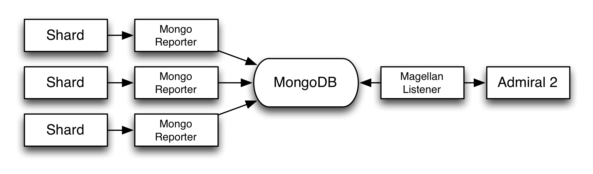

Admiral 2 Code Structure
========================

Here is a high level view of the project structure:

| Directories/Files | What's Up |
|-----------|-----------|
| /client | The client side portion of the code |
| /client/components | Shared low level rendering components |
| /client/pages | Components for each of the main pages |
| /client/pods | React compoents for pod rendering, used on the phase home screen |
| /client/utilities | Helper functions for the client |
| /client/main.css | The CSS (should be CSS modules but isn't) |
| /client/main.html | The SPA host page |
| /client/main.js | Route definitions |
| /images | Images for this document |
| /imports | Code shared between the client and the server |
| /imports/api | CRUD classes for the Mongo collections |
| /imports/reports | Helper functions to build the high level rollup reports that are show on the home screen, project landing page, and project/phase landing page |
| /imports/utilities | Shared utility functions between the client and the server |
| /public | Static assets |
| /server | The server code |
| /server/analytics | Code to update the pod reports after each run |
| /server/listeners | The home for listeners, which currently amounts to the Magellan listener |
| /server/main.js | The base routes for the SPA, and the two REST APIs |
| /tests | Tests, such as they are |

# How Admiral2 talks to Magellan

This is a high level view of how Magellan test data will get to Admiral2 for the Looper rollout:

Each one of the Shards uses a [Mongo Reporter](https://github.com/TestArmada/magellan-mongo-reporter) instance to send the raw events to a centralized MongoDB instance. The [Magellan listener](https://github.com/TestArmada/admiral2/blob/master/server/listeners/magellan.js) code in Admiral2 monitors that MongoDB instances oplog, sees the raw messages, uses [manifest](https://github.com/TestArmada/manifest) to turn the raw events into something high level, and then uses the same calls as the REST APIs to inject the data into the Admiral2 DB.

# Grimy little details

These are somethings you should be mindful of.

## The schema is mostly undefined

The REST API and the UI of Admiral2 have a loose consensus on what fields should go into `Project`, `ProjectPhase`, `TestRun` and `TestResult`. This is mostly an artifact of the current state of Admiral2 development. As the feature set solidifies we should ensure that required fields are specfied and optional fields are in the right format.

Also, the UI is written very defensively so that UI elements are only shown if the data fields exist in the corresponding MongoDB object. And we should continue with that.

## Two REST APIs

There are two REST APIs in `/server/main.js`. The [first](https://github.com/TestArmada/admiral2/blob/master/server/main.js#L79-L292) is our custom API mounted on `/api/*` that handles creating projects, phases, runs and posting test results. The [second set of REST](https://github.com/TestArmada/admiral2/blob/master/server/main.js#L294-L310) endpoints is a bulk data read service mounted on `/rest/*` that is really just there for developer's convenience to see what's in the database.

## There are two ways to get data into Admiral2

There are two ways to get data into Admiral2, the first is the REST API mentioned above, and the second is through the Magellan listener.

Because there are two ways to get data into Admiral2 there are two test data loaders.

## Metrics is in there, but isn't visualized

In a clear violation of [YAGNI](https://martinfowler.com/bliki/Yagni.html) there is code in there for REST endpoints for adding metrics values to a test run, but they aren't shown anywhere in the UI.

## There are a lot of features that Looper users won't see

Custom attributes, our cool node base visualization of what's tests are hitting what part of the site, step timings, custom pods on the phase home screen, these are all cool features of Admiral2 that Looper customers won't see because they require project setup that isn't done automatically. Plus it would require additional Magellan work to extra data like custom attributes.

Because we have a REST API we do allow people to update the `Project` and `ProjectPhase` objects where most of the data for these cool features resides, but... in reality we would probably want to put a UI on that so that people wouldn't have to `POST` to endpoints just to update the data.

## Two MongoDB Connections

By default a Meteor app either launches it's own MongoDB or connects to an existing MongoDB for data storage. Admiral2 is no exception. It uses Meteor's MongoDB connection for all the basic CRUD work. But it also has a connection to *another* oplog-only MongoDB instance which is written to by Magellan. You specify the location of that connection using the environment variables `MAGELLAN_MONGO_HOST`, `MAGELLAN_MONGO_USER` and `MAGELLAN_MONGO_PASSWORD`.

## The MongoDB oplog and why it's important

When MongoDB is setup for [replication mode](https://docs.mongodb.com/manual/replication/) it means that you have a primary server and zero or more secondary servers that act as backups in case the primary server goes down. The secondary servers are not writeable. The way the secondary servers synchronize with the primary server is through the [oplog](https://docs.mongodb.com/manual/core/replica-set-oplog/). The "operations log" or `oplog` is just a streaming set of events that contain the collection name, the operation type (insert, update, delete) and the data.

When you insert, update or delete on the primary server, the server executes that, then inserts a message into the `oplog` channel. Secondary servers then apply that same insert, update or delete command to their DB. Don't ask me how the two servers initially sync up, or what happens when the secondary loses connection to the primary, I don't know. But that's actually not germane for the way that we use the `oplog`.

For all intents and purposes you can think of the `oplog` as an event queue similar to RabbitMQ.

As mentioned above we have two MongoDB connections. Both of those servers need to be set into replication mode so that we have an `oplog` to monitor.

On the Admiral2 client side the `oplog` is used to drive the real-time mechanism of the UI. This is built into Meteor and you don't have to mess with it, it's just implicit within the framework. If Meteor is launching the server then the `oplog` will be enabled by default. If you give the server another MongoDB instance then that instance needs to have replication enabled so you get the `oplog`.

Admiral2 uses the `oplog` on the Magellan MongoDB istance to monitor for events coming out of the Magellan shards that are posted by the [Mongo reporter](https://github.com/TestArmada/magellan-mongo-reporter).

## Fibers

Meteor uses Fibers, which is probably something Electrode should do. What this means is that sometimes you'll run into issues when writing to MongoDB isn't allowed in a non-Fiber context. So some nasty little workarounds get you back into Fiber-land. The only example of this is the Magellan listener that has to use [Meteor.setTimeout](https://github.com/TestArmada/admiral2/blob/master/server/listeners/magellan.js#L147) to manage the incoming event messages from Magellan. Ideally the code would go right in the handler at the time of processing the message, but because of Fibers it needs to get back into the main Fiber land so that it can write to the Admiral2 MongoDB.

# What's next

We have [roadmap for Admiral 2](https://confluence.walmart.com/display/~jherri1/Admiral+2+Roadmap) features that includes all of the different Otto teams. I’ll go into detail about what is expected from each one:

**Mobile Test** – This is taking data from Renas’ mobile tests and integrating it. It would be a matter of either getting his code to talk to our REST API, or emulating the Admiral 1 API and pointing him at it. The structure of the data is exactly the same. Though there might be some additional coverage information that needs to be visualized.

**ADA** – For ADA data, in phase 1 at least, we just want to show the top line conformance numbers and then have drill down links to Chi’s ADA server.

**Rapido** – Rapido needs to send front end performance numbers, probably through the rest API, to Admiral 2. Rapido runs a parallel set of Jenkins jobs, so they will need to align, probably with the run ID, to ensure that both test data result data and performance data go to the asme place. We will also need custom visualizations for the performance data. As with ADA the intention was to show high level numbers first and drill-down links.

**Shifu** – Shifu is the most interesting integration because we will need to come up with custom visualizations to show just how much of the API surface area was mocked, and how many calls were made to what APIs. It was agreed that Shifu would only send data to Admiral 2 during pr-verify or master runs, that sending data during development builds and test runs would be hard to model, flakey and obtrusive to developers.

**Mobile ADA** – We didn’t talk about this much, but it would probably be roughly similar to what we would do for web ADA.

**Hygia integration** – Services uses Hygia to monitor it’s tests. Hygia is an open source dashboard based on Angular. It remains a question as to whether Admiral 2 will integrate with it through iframe (or something), or whether the feature set of Hygia would be replaced by Admiral 2, which would replace Hygia entirely.

## Self Service

A theme of Admiral 2 that we developed during the offsite was to use it as a ‘self service’ portal.  The idea is fairly simple, if we don’t have ADA data, for example, then we click through to a static screen that shows how to set up ADA tests.

## More testing

We need more unit tests.
